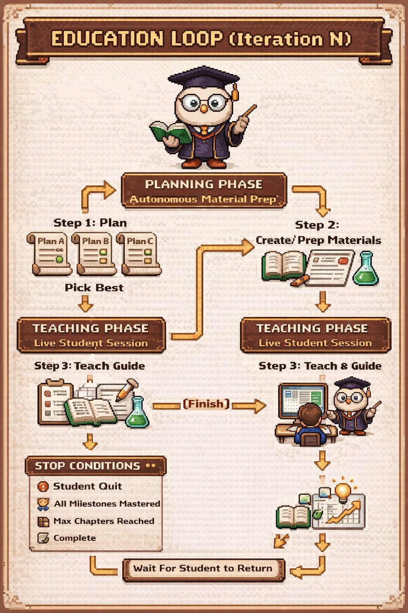

# Claude for Education

<p align="center">
  
</p>

**Personalized adaptive learning system powered by Claude Code agents — tailored to each student's pace, learning style, and goals.**

---

## Overview

Claude for Education is an intelligent tutoring system that brings the philosophy of **adaptive personalized learning** to life. It adapts content, pacing, and teaching approach based on real-time feedback and continuous evaluation. Rather than one-size-fits-all lessons, the system generates bespoke learning materials and responds dynamically to how each student learns best.

**Key philosophy:** Every student learns differently. This system respects that by personalizing every aspect of education — from curriculum design to teaching method to buddy companionship.

---

## Architecture

The system orchestrates 7 specialized Claude Code agents through an **8-step education loop** with democratic planning and crash recovery.

<p align="center">
  
</p>

### Agent Registry

| Step | Agent | Type | Role | Parallelism |
|------|-------|------|------|-------------|
| Setup | `edu-setup` | Skill | Interactive first-time wizard | 1 |
| Setup | `edu-researcher` | Agent | Research materials, build knowledge graph | 1 |
| 1 | `edu-planner` | Agent | Propose personalized lesson plans | **3 parallel** |
| 2 | `edu-critic` | Agent | Score & select best proposal | 1 |
| 3 | `edu-architect` | Agent | Expand plan, detail, veto if needed | 1 |
| 4 | `edu-creator` | Agent | Generate HTML lesson + quiz | 1 |
| 5 | `edu-teacher` | Agent (teammate) | Run live session, chat with student | 1 (long-lived) |
| 6 | `edu-evaluator` | Agent | Assess performance, recommend next | 1 |

### Democratic Planning

The system uses a **checks-and-balances design:**

```
3 Planners propose independently
        ↓
    Critic scores all 3
        ↓
   Architect reviews winner
        ↓
  Can VETO back to planning
        ↓
   Critic can reject all
        ↓
  Planners re-propose
```

This ensures no single perspective dominates — creativity, proven methods, and remedial focus all get heard.

---

## Features

### Core Learning
- **Adaptive curriculum** — lessons adjust based on mastery, not clock time
- **Multi-mode learning** — chat, quizzes, assignments, or mixed
- **Real-time feedback** — teacher agent responds to student questions during session
- **Crash recovery** — if system crashes mid-session, resumes from exact step
- **Resumable sessions** — student can pause and come back; loop awaits their return

### Personalization
- **Age-adaptive design** — playful for kids, modern for teens, refined for adults
- **Difficulty adjustment** — challenging, balanced, or gentle based on performance
- **Buddy companion system** — optional fox, robot, or fairy buddy with XP/leveling (young learners)
- **Learning style matching** — visual, text, interactive, examples

### Intelligence
- **Democratic planning** — 3 competing planners, critic selects best, architect vetos if needed
- **Evaluation-driven adaptation** — every chapter leads to next-chapter recommendations
- **Milestones & mastery tracking** — 0.0-1.0 mastery per topic, visible progress
- **Rich evaluation** — combines quiz analysis, chat analysis, engagement tracking
- **Concurrent material prep** — next chapter auto-generates while student studies current one

### Data & Privacy
- **JSONL split pattern** — separate student/teacher logs avoid concurrent-write conflicts
- **4-layer state tracking** — settings, loop state, active agents, current status for recovery
- **Audit trail** — full history of sessions, evaluations, curriculum adaptations
- **No external APIs for core teaching** — all done in-process with Claude agents

---

## Prerequisites

### Required
- **Claude Code** (installed and configured) — available at https://github.com/anthropic-ai/claude-code
- **Node.js** 14+ with npm — for the Express server and dependencies
- **Bash/Zsh shell** — orchestrator scripts use shell commands

### Optional
- **pdftotext** (Xpdf tools) — for PDF material processing in setup (otherwise text extracted via Read tool)
- **Browser** — for interactive student dashboard (auto-opens if `auto_open_browser: true`)

---

## Quick Start

### 1. Clone or extract the project

```bash
cd /path/to/claude-for-education
npm install --prefix server
```

### 2. Run the setup wizard

Inside Claude Code:

```
/edu-setup
```

This interactive wizard will:
- Welcome you and explain the system
- Ask what topic you want to learn
- Collect your education level, age group, learning mode, difficulty preference
- Offer a buddy companion (fox, robot, fairy)
- Invoke the researcher agent to build a knowledge graph
- Initialize student profile, course plan, and settings

**Output files created:**
- `teaching_process/student_profile.json` — your learning profile
- `teaching_process/course_plan.json` — curriculum structure
- `teaching_process/settings.json` — runtime settings (port, timeout, buddy mode)

### 3. Start teaching

Once setup completes, the orchestrator enters the **education loop**:

```bash
# The orchestrator runs automatically via SessionStart hook
# On next session start, it resumes from where it left off
```

**What happens:**
1. Steps 1-4 run autonomously to prepare the first lesson
2. When ready, system launches interactive session on `http://localhost:3456`
3. Student studies, takes quizzes, chats with teacher agent
4. After completion, system evaluates and prepares next lesson
5. Student returns for next session, loop repeats

### 4. Monitor progress

Open the dashboard in browser:

```
http://localhost:3456/dashboard
```

Or read the status file:

```bash
cat teaching_process/current_status.json
```

---

## How It Works

### The 8-Step Loop Explained

#### Step 1: Planning (Planners)
3 planner agents independently propose a lesson plan for the next chapter:
- **Planner A** (Conservative): Safe, proven approach aligned with prerequisites
- **Planner B** (Creative): Experimental, novel pedagogical techniques
- **Planner C** (Weakness-focused): Targets identified weak areas or past failures

All run in parallel. Each produces a detailed proposal with rationale, risk analysis, and expected outcomes.

#### Step 2: Criticism (Critic)
Critic agent scores all 3 proposals on:
- Student fit (level, prerequisites, learning mode)
- Alignment with goals and milestones
- Pedagogical soundness
- Originality vs. repetition

Selects the winner (highest score >= 6.0). If all rejected (< 6.0), triggers re-plan cycle (max 2 retries).

#### Step 3: Architecture (Architect)
Architect expands the winning plan into detailed spec with:
- Per-section subsections and content directives
- Visual element hints (diagrams, tables, examples)
- Interactive element suggestions (quizzes, exercises)
- Design hints for the creator (layout, tone, buddy behavior)

Can **VETO** if structural issues found (prerequisites violated, flow broken, etc.) — sends back to Step 1 with feedback. Max 2 veto cycles.

#### Step 4: Creation (Creator)
Creator agent reads the detailed architectural spec and generates:
- Interactive HTML lesson (`teaching_process/html_materials/{chapter_id}/index.html`)
- Embedded quiz with configurable question types
- Buddy messages (if enabled)
- Age-appropriate styling and layout

Uses frontend-design skill for polished, responsive HTML.

#### Step 5: Teaching (Teacher Agent — Teammate)
Teacher launches a local Express server on port 3456 and:
- Serves the HTML lesson to student
- Polls student JSONL for chat messages and quiz answers
- Responds to questions in real-time
- Shows quiz feedback and buddy encouragement
- Records all interactions in session JSONL (one line per event)
- Waits for student to click "Complete" or timeout

This is a **long-lived teammate** — stays alive during entire session. When student finishes, returns control to orchestrator.

#### Step 6: Evaluation (Evaluator)
Evaluator analyzes the session by:
- Merging student + teacher JSONL by timestamp
- Selecting evaluation methods (quiz analysis, chat depth, engagement)
- Computing scores: quiz%, understanding, confidence, engagement
- Writing evaluation report with strengths, weaknesses, recommendations
- Updating student profile with new mastery levels and XP (if buddy enabled)

#### Step 7: Re-Planning (Orchestrator)
Based on evaluation recommendations:
- If `ready_for_next_chapter: true` → advance to next chapter
- If `ready_for_next_chapter: false` → insert practice/remedial chapter
- Update course plan with adaptation log (why we chose this path)
- Check stop conditions (all milestones mastered? max chapters? quit?)

#### Step 8: Recording & Autonomous Prep (Orchestrator)
- Append session to history log
- **Autonomously run Steps 1-4 for next chapter** while student is away
- After Step 4 completes, set status to `"waiting"`
- When student returns, resume from Check Stop Conditions → Step 1

---

## Project Structure

```
claude-for-education/
├── README.md                          # This file
├── CLAUDE.md                          # Orchestrator brain (8-step loop, error handling, state tracking)
├── AGENTS.md                          # Agent documentation (optional, auto-generated by oh-my-claudecode)
├── package.json                       # Node.js dependencies
│
├── docs/
│   ├── theory/
│   │   └── data_contracts.md          # JSON/JSONL schema definitions for all files
│   └── setup.md                       # Setup phase documentation
│
├── server/                            # Express server for interactive lessons
│   ├── index.js                       # Main server file (routes, static serving)
│   ├── package.json                   # Server dependencies (express, etc.)
│   ├── lib/
│   │   └── paths.js                   # Path construction utilities
│   ├── api/
│   │   ├── quiz.js                    # POST /api/quiz/* — quiz submission handling
│   │   ├── chat.js                    # POST /api/chat/* — student message polling
│   │   ├── session.js                 # GET /api/session/* — session status
│   │   ├── student.js                 # GET /api/student/* — profile, course plan
│   │   └── progress.js                # GET /api/progress/* — dashboard data
│   └── static/
│       ├── index.html                 # Home page (lesson list, links)
│       └── dashboard/
│           └── index.html             # Progress dashboard
│
├── claude/                            # Claude Code configuration & agents
│   ├── settings.json                  # Claude Code hooks & automation config
│   ├── agents/
│   │   ├── edu-researcher/
│   │   │   ├── CLAUDE.md              # Researcher agent prompt
│   │   │   └── skills/
│   │   │       ├── edu-concept-mapper/SKILL.md
│   │   │       ├── edu-material-organizer/SKILL.md
│   │   │       └── edu-pdf-processor/SKILL.md
│   │   ├── edu-planner/
│   │   │   ├── CLAUDE.md              # Planner agent prompt
│   │   │   └── skills/
│   │   │       ├── edu-chapter-designer/SKILL.md
│   │   │       ├── edu-evaluation-analyzer/SKILL.md
│   │   │       └── edu-material-reader/SKILL.md
│   │   ├── edu-critic/
│   │   │   └── CLAUDE.md              # Critic agent prompt
│   │   ├── edu-architect/
│   │   │   └── CLAUDE.md              # Architect agent prompt
│   │   ├── edu-creator/
│   │   │   ├── CLAUDE.md              # Creator agent prompt
│   │   │   └── skills/
│   │   │       └── edu-quiz-generator/SKILL.md
│   │   ├── edu-teacher/
│   │   │   └── CLAUDE.md              # Teacher agent prompt
│   │   └── edu-evaluator/
│   │       ├── CLAUDE.md              # Evaluator agent prompt
│   │       └── skills/
│   │           ├── edu-chat-analyzer/SKILL.md
│   │           ├── edu-quiz-analyzer/SKILL.md
│   │           └── edu-score-calculator/SKILL.md
│   └── skills/
│       ├── edu-setup/SKILL.md         # Setup wizard (first-time only)
│       ├── edu-goal-clarifier/SKILL.md # Resolve ambiguous topics
│       └── edu-session-launcher/SKILL.md # Start Express server + health check
│
└── teaching_process/                  # Runtime state (student-specific)
    ├── settings.json                  # Current runtime config (status, port, buddy_mode, etc.)
    ├── student_profile.json           # Student info, goals, milestones, buddy state
    ├── course_plan.json               # Curriculum: chapters, status, adaptation log
    ├── loop_state.json                # Per-iteration state tracking (for resumability)
    ├── active_agents.json             # Registry of active/completed agents (crash recovery)
    ├── current_status.json            # Human-readable status (dashboard view)
    ├── materials_index.json           # Index of uploaded/collected materials
    ├── materials/                     # Original uploaded materials (PDFs, etc.)
    ├── materials_markdown/            # Processed materials as markdown
    ├── plans/
    │   ├── {chapter_id}_planner_a.json    # Planner A's proposal
    │   ├── {chapter_id}_planner_b.json    # Planner B's proposal
    │   ├── {chapter_id}_planner_c.json    # Planner C's proposal
    │   ├── {chapter_id}_critic_selection.json # Critic's scoring & selection
    │   ├── {chapter_id}_architect_review.json # Architect's veto feedback (if any)
    │   └── {chapter_id}.json          # Canonical plan (expanded by architect)
    ├── html_materials/
    │   ├── {chapter_id}/
    │   │   ├── index.html             # Lesson HTML
    │   │   ├── styles.css             # Styling
    │   │   └── script.js              # Interactivity
    │   └── ...
    ├── sessions/
    │   ├── {session_id}.meta.json     # Session metadata (started_at, completed_at, scores)
    │   ├── {session_id}.student.jsonl # Student events (page views, chat, quiz)
    │   ├── {session_id}.teacher.jsonl # Teacher responses
    │   └── {session_id}.completed    # Completion signal file
    ├── evaluations/
    │   └── {eval_id}.json             # Evaluation report (scores, recommendations)
    └── history/
        ├── raw_data.json              # Full session log (all iterations)
        └── progress_summary.json      # Compact progress (chapters done, scores, etc.)
```

---

## Tech Stack

### Backend
- **Node.js + Express.js** — Local server for interactive lessons
- **Claude Code** — Agent orchestration, coordination, crash recovery
- **7 specialized agents** — Plan, criticize, architect, create, teach, evaluate
- **13 sub-skills** — Material processing, quiz generation, chat analysis, etc.

### Data Format
- **JSON** — Configuration, profiles, plans, evaluations, session metadata
- **JSONL** — Append-only student/teacher logs (avoids concurrent-write issues)
- **HTML/CSS/JavaScript** — Generated lessons (responsive, accessible)

### Philosophy
- **Agent-based architecture** — Each agent owns one piece of the puzzle
- **Democratic planning** — Multiple proposals, scored fairly, architect has veto
- **Crash-resilient** — 4-layer state tracking enables resumability at any step
- **Autonomous preparation** — Next lesson pre-generates while student studies current one

---

## Configuration

### Settings File

Edit `teaching_process/settings.json` to control runtime behavior:

```json
{
  "status": "preparing|teaching|evaluating|planning|waiting|idle",
  "current_phase": "teach|plan|evaluate|replan",
  "server_port": 3456,
  "session_timeout_minutes": 120,
  "buddy_mode": true,
  "max_chapters": 50,
  "auto_advance": false,
  "auto_open_browser": true,
  "chat_poll_interval_ms": 2000,
  "setup_complete": true
}
```

| Field | Meaning |
|-------|---------|
| `status` | Current orchestrator state (for dashboard & resumability) |
| `server_port` | Where Express server listens |
| `session_timeout_minutes` | Max time per session before auto-complete |
| `buddy_mode` | Enable/disable study buddy companion |
| `max_chapters` | Stop after this many chapters (completion condition) |
| `auto_open_browser` | Auto-launch browser on session start |

### Student Profile

Edit `teaching_process/student_profile.json` to override student preferences:

```json
{
  "student_id": "student_...",
  "topic": "Mathematics",
  "age_group": "teen",
  "learning_mode": "mixed",
  "buddy_config": {
    "buddy_enabled": true,
    "buddy_character": "fox",
    "buddy_name": "Luna"
  }
}
```

---

## Development & Customization

### Add a New Skill

Create a directory under `claude/agents/{agent_name}/skills/{skill_name}/`:

```
claude/agents/edu-creator/skills/my-new-skill/
├── SKILL.md       # Skill description & implementation guide
└── (helper scripts, if needed)
```

### Customize Agent Behavior

Edit the agent's `CLAUDE.md` prompt:

```
claude/agents/edu-planner/CLAUDE.md    # Customize planning criteria
claude/agents/edu-critic/CLAUDE.md     # Customize scoring rubric
claude/agents/edu-creator/CLAUDE.md    # Customize HTML generation style
```

### Add Evaluation Methods

Edit `claude/agents/edu-evaluator/CLAUDE.md` to add new evaluation methods (e.g., essay scoring, peer comparison).

### Modify the 8-Step Loop

The loop is orchestrated in `CLAUDE.md`. To change steps:

1. Edit the step description in CLAUDE.md
2. Update `loop_state.json` schema if adding/removing steps
3. Update the agent registry table in this README

---

## API Endpoints

### Dashboard & Status
- `GET /` — Home page (lesson link, navigation)
- `GET /dashboard` — Progress dashboard
- `GET /api/session/current` — Current session status
- `GET /api/session/history` — Past sessions

### Student Data
- `GET /api/student/profile` — Student profile JSON
- `GET /api/course/plan` — Course plan JSON
- `POST /api/progress/update` — Record progress update

### Interactive Session
- `GET /lesson/{chapter_id}` — Serve lesson HTML
- `POST /api/quiz/submit` — Submit quiz answers
- `POST /api/chat/send` — Send student message
- `GET /api/chat/poll` — Poll for teacher response

See `server/api/*.js` for implementation details.

---

## Troubleshooting

### Session won't start

**Check:**
1. Is Node running? `ps aux | grep node`
2. Port conflict? `lsof -i :3456` or change `server_port` in settings.json
3. Materials missing? Verify `teaching_process/html_materials/{chapter_id}/index.html` exists

**Recovery:** Delete `teaching_process/sessions/{session_id}.completed` to retry.

### Evaluator says "not ready for next chapter"

This is normal! The system will:
1. Insert a remedial/practice chapter
2. Re-plan the curriculum
3. Generate new materials for the practice chapter
4. Student re-takes the lesson

Mastery is not linear — gaps are caught and addressed.

### Orchestrator crashes mid-loop

The system is resumable:

1. Check `teaching_process/loop_state.json` to see what step failed
2. Check `teaching_process/active_agents.json` to see which agents are stuck
3. If an agent is still "active": manually verify if it finished (check output files)
4. Update the status in `active_agents.json`: set `status: "completed"` if done
5. Re-start Claude Code session — orchestrator will resume from the first incomplete step

### Student profile lost

All data is in `teaching_process/`. Back up this directory regularly:

```bash
cp -r teaching_process teaching_process.backup.$(date +%s)
```

---

## Learning Philosophy

### Adaptive Personalized Learning

This educational philosophy emphasizes **meeting students where they are** — not where a curriculum mandates they should be. Claude for Education implements this by:

1. **Assessment first** — Evaluate current understanding before planning
2. **Personalized pace** — Each student moves at their own speed
3. **Multiple perspectives** — 3 planners ensure diverse approaches
4. **Continuous feedback** — Every session leads to adaptation
5. **Respect for style** — Visual, auditory, kinesthetic learners all supported
6. **Buddy support** — Optional companion for younger learners (psychological safety)

The goal is not standardization but **mastery** — when a student truly understands a concept (mastery >= 0.9), they move forward. Not before, not after. Not grouped by age or grade, but by actual learning.

---

## Contributing & Customization

This system is built to be **extended, not forked**. To customize:

### For educators
- Add new evaluation methods in `edu-evaluator/CLAUDE.md`
- Customize buddy messages in `edu-teacher/CLAUDE.md`
- Add subject-specific skills in `claude/agents/{agent}/skills/`

### For developers
- Add new API endpoints in `server/api/`
- Extend dashboard in `server/static/dashboard/`
- Modify planning criteria in `edu-planner/CLAUDE.md`

### For researchers
- Log detailed iteration data in `teaching_process/history/raw_data.json`
- Analyze adaptation patterns in `course_plan.adaptation_log`
- Study agent decision-making in individual `*_planner_*.json` files

---

## Known Limitations

- **Teacher responsiveness:** Depends on Claude API latency (typically 2-5 seconds per message)
- **Material quality:** Only as good as input materials and agent prompts — GIGO applies
- **No persistence across machines:** `teaching_process/` is local; export/backup to sync elsewhere
- **Single student:** One `teaching_process/` per student. For multiple students, create separate project directories

---

## Support & Resources

- **Main Documentation:** See `CLAUDE.md` for orchestrator design, error handling, resumability
- **Data Schemas:** See `docs/theory/data_contracts.md` for all JSON/JSONL structures
- **Agent Documentation:** See `claude/agents/{name}/CLAUDE.md` for each agent's role
- **Skill Documentation:** See `claude/skills/{name}/SKILL.md` for interactive helpers

---

## License

MIT — See LICENSE file for details.

---

## Credits

Built with [Claude Code](https://github.com/anthropic-ai/claude-code) and the Anthropic Claude API. Designed for educators, students, and anyone who believes learning should be personalized, not standardized.

**Philosophy inspiration:** Adaptive personalized learning.

---

## Roadmap

Future enhancements:
- Multi-student orchestration (manage several students' courses in parallel)
- Expanded evaluation methods (essay scoring, rubric-based grading, peer comparison)
- Advanced buddy mechanics (collaborative buddies, buddy-to-buddy challenges)
- Integration with external APIs (web search for research materials, external quizzes)
- Offline-first mode (cache materials, sync when online)
- Export to standard formats (PDF progress reports, transcript-style summaries)

---

**Start learning.** The system will adapt. Trust the loop.
